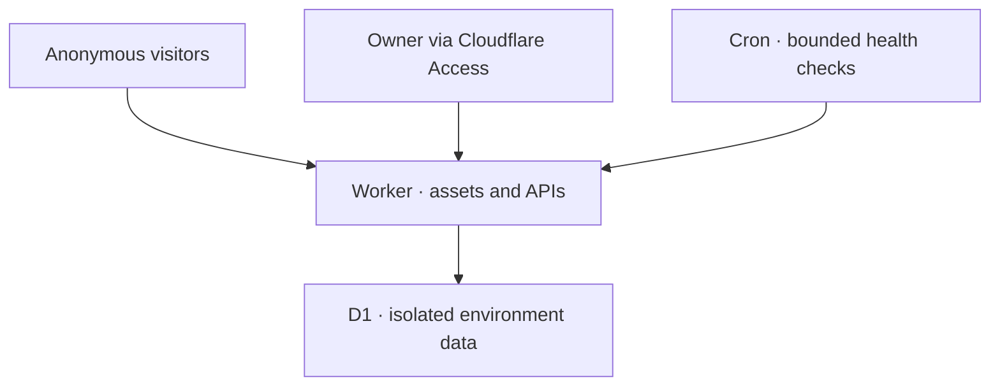

<h1 align="center">⛰️ cf-nav · Lily / 寻迹</h1>

<p align="center">
  <strong>A quiet digital garden for links worth keeping.</strong><br>
  A public navigation catalog. One administrator. Powered by Cloudflare.
</p>

<p align="center">
  <a href="https://developers.cloudflare.com/workers/"></a>
  <a href="https://developers.cloudflare.com/d1/"></a>
  <a href="https://www.typescriptlang.org/"></a>
  <a href="LICENSE"></a>
  <a href="https://github.com/jacklilyhello/cf-nav/actions/workflows/ci.yml"></a>
</p>

<p align="center">
  <strong>English</strong> · <a href="README_zh.md">简体中文</a><br>
  <a href="https://nav.lily.lat/">Live demo</a> · <a href="#deployment">Deployment</a> · <a href="https://github.com/jacklilyhello/cf-nav/issues">Issues</a>
</p>


**cf-nav** is a navigation and bookmark catalog built with **TypeScript, Vite, Cloudflare Workers, D1, Cron Triggers and Cloudflare Access**. Visitors discover curated resources through categories and search; a single administrator maintains links, icons and evidence from scheduled health checks.

The [live example](https://nav.lily.lat/) uses Lily's branding and a Chinese interface. Both READMEs describe the same implementation; an English application interface is not currently provided.

> [!IMPORTANT]
> The upstream deployment is configured for **nav.lily.lat and its existing Cloudflare resources**. **A fork plus Secrets alone is not a new-site installer.** Adapt resource names, database IDs, Access identity, hostnames and guarded deployment scripts before enabling deployment in a fork. The [deployment guide](docs/deployment.md#english) separates existing-site releases from first-time setup.

## Contents

- [Features](#features)
- [Screenshots](#screenshots)
- [Architecture](#architecture)
- [Deployment](#deployment)
- [Local development](#local-development)
- [Administration and operations](#administration-and-operations)
- [Troubleshooting](#troubleshooting)
- [Project structure](#project-structure)
- [Contributing](#contributing)
- [References](#references)
- [License](#license)

## Features

| Area            | What you get                                                                                                                       |
| --------------- | ---------------------------------------------------------------------------------------------------------------------------------- |
| Discovery       | Grouped cards, category filters, featured recommendations and search across names, URLs, descriptions and categories               |
| Appearance      | Responsive layouts, a restrained landscape design, and Auto / Light / Dark on the public site and administrator workspace          |
| Curation        | Category ordering, link editing, enabled/featured states, descriptions and administrator-only notes                                |
| Icons           | Automatic HTTPS icon discovery, manual HTTPS images or text, and a local initial tile when no usable icon is available             |
| Link health     | HTTP status, redirect evidence, observed titles, content identity checks, history, manual rechecks and independent human overrides |
| Scheduling      | Bounded Cron work, shared request spacing, per-site deadlines and D1 continuations for long intervals                              |
| Search indexing | A production-only switch coordinating robots.txt, robots meta, X-Robots-Tag, sitemap and canonical origin                          |
| Administration  | One owner authenticated by Cloudflare Access, verified Access JWTs and same-origin CSRF protection                                 |
| Data            | Separate staging/production D1 databases, versioned migrations, one-time starter seed and validated JSON export/import             |
| Delivery        | GitHub Actions CI, explicit production deployment and a separate guarded custom-domain operation                                   |

Auto follows the device's `prefers-color-scheme`; manual theme choices persist locally and survive reloads. Auto means the device's appearance preference, not a fixed sunrise/sunset schedule.

The platform serves anonymous readers and **one administrator**. Public registration, team roles, comments and multi-user bookmark synchronization are outside its current scope. No VPS, KV, R2, Queue or Durable Object is required.

## Screenshots

The light homepage is shown above. Public screenshots were captured from nav.lily.lat on **3 October 2026**; the five administrator screenshots were supplied by the owner on the same date. Visible administrator email addresses are redacted. Counts and probe results are snapshots, not availability guarantees.

### Public catalog · dark appearance


### Search · names, URLs and descriptions


### Categories · focused browsing


### Administrator · navigation resources


### Administrator · category management


### Administrator · health monitoring


### Administrator · health detail


### Administrator · site settings


All nine screenshots are versioned under `docs/screenshots/` and fully expanded using repository-relative paths. The public demo does not provide shared administrator credentials.

## Architecture

One Worker serves the Vite-built frontend through **Workers Static Assets** and handles public/admin JSON APIs. **D1** stores categories, links, settings, health history and pending jobs. **Cloudflare Access** supplies the administrator identity; the Worker independently validates it on every admin API request.



Staging and production have separate Workers, databases and Access application audiences. Each login hostname has its own Access application. The public catalog omits private notes and disabled links/categories.

Health checks validate URLs, DNS answers and redirects, enforce request/body limits, and use the required `global_fetch_strictly_public` compatibility flag. HTTP 200 alone does not prove that a site still provides its original service; a WAF challenge, 403 or 429 does not prove that it is dead. Failed checks never automatically delete or permanently hide resources.

See [architecture](docs/architecture.md) for authentication, SSRF, data lifecycle and design details.

## Deployment

### 1. Prepare Cloudflare and GitHub

You need a Cloudflare account with Workers, D1 and a configured Zero Trust team, a domain in that account for a custom hostname, and GitHub Actions enabled. Billing and limits follow your Cloudflare plan; zero cost at every scale is not guaranteed.

In GitHub, open **Repository → Settings → Secrets and variables → Actions**. Add the token under **Secrets**, and the following identifiers under **Variables**:

| Type     | Name                    | Where to get it / upstream meaning                                                           |
| -------- | ----------------------- | -------------------------------------------------------------------------------------------- |
| Secret   | `CLOUDFLARE_API_TOKEN`  | Cloudflare → My Profile → API Tokens → Create Token → Custom token; copy it once into GitHub |
| Variable | `CLOUDFLARE_ACCOUNT_ID` | Account details or domain Overview → API section                                             |
| Variable | `CLOUDFLARE_ZONE_ID`    | Target domain Overview → API section → Zone ID                                               |
| Variable | `CF_WORKER_NAME`        | Production Worker name; upstream domain operation requires `cf-nav`                          |
| Variable | `CF_PRODUCTION_DOMAIN`  | Hostname without scheme/path; upstream requires `nav.lily.lat`                               |

These names match the actual workflows. Database IDs and Access configuration live in `wrangler.jsonc`; adding similarly named GitHub variables will not override them. Worker names and workers.dev smoke targets also appear in workflow/script code.

### 2. Create a scoped API token

Scope account permissions to the **target account** and zone permissions to the **target zone**. Cloudflare may label write permission as **Edit** in its dashboard and **Write** in API documentation.

| Scope   | Permission                                                   | Used for                                                 |
| ------- | ------------------------------------------------------------ | -------------------------------------------------------- |
| Account | Workers Scripts · Edit/Write                                 | Worker deployment, settings, Static Assets and schedules |
| Account | D1 · Edit/Write                                              | Database creation, migrations and first-time seed        |
| Account | Account Settings · Read                                      | Account/subdomain discovery used by Wrangler             |
| Account | Access: Apps and Policies · Edit/Write                       | Provisioning the single-owner login applications         |
| Account | Access: Organizations, Identity Providers, and Groups · Read | Reading the Zero Trust organization/team domain          |
| Zone    | Workers Routes · Edit/Write                                  | Route inspection and custom-domain operations            |
| Zone    | Zone · Read                                                  | Zone lookup for hostname operations                      |

See the [official token guide](https://developers.cloudflare.com/fundamentals/api/get-started/create-token/) and [permission reference](https://developers.cloudflare.com/fundamentals/api/reference/permissions/). This table covers provisioning, deployment and domain workflows; ordinary code updates do not need every permission. No R2/KV permission is needed. DNS editing is separate if you choose to manage DNS records yourself; the included scripts use Workers custom-domain APIs.

### 3. Release the existing upstream site

| Step                | Action                                                              | Result                                                                                              |
| ------------------- | ------------------------------------------------------------------- | --------------------------------------------------------------------------------------------------- |
| Inspect             | Actions → **Cloudflare Resources** → `inspect`                      | Reads resources and current domain binding; uploads inventory                                       |
| Provision if needed | **Cloudflare Resources** → `provision`                              | Verifies the existing binding/owner, creates named resources; does not deploy Worker or move domain |
| Stage               | Merge to `main`, or dispatch **Deploy** with `staging`              | Checks, migrations, first-use seed, deployment and workers.dev smoke                                |
| Accept              | Browse staging                                                      | Check search, categories, themes and real authenticated administrator operations                    |
| Release             | Dispatch **Deploy** from `main` with `production`                   | Deploys production; domain binding is separate                                                      |
| Bind if needed      | **Production Domain** from `main`, `production`, acceptance checked | Verifies production source SHA and binding, then moves only the configured hostname                 |

Normal pushes to `main` deploy **staging**, not production. The legacy `codex/cloudflare-navigation` branch also triggers staging deployment. Other `codex/` branches run CI without automatic deployment. Provisioning returns IDs in an artifact; it does **not** rewrite `wrangler.jsonc`.

If the domain already points at the production Worker, production deployment updates its served code without another cutover. Preserve `websitenavigation` for the upstream rollback path.

### 4. Deploy a fork as a separate site

Before enabling fork deployment, follow the [first-time setup guide](docs/deployment.md#new-site-or-fork). Create isolated staging/production databases, configure your Access applications and owner hash, replace upstream hostnames/resource IDs, and adapt scripts that assume an existing Lily installation. **Changing only `CF_PRODUCTION_DOMAIN` is insufficient.**

The current resource/domain scripts intentionally reject a fresh hostname without the expected previous binding. Do not run them unchanged against a new site. The guide includes a manual initial resource route and the files to adapt.

## Local development

Use **Node.js 22.22+** within the package's supported range (`>=22.22.0 <27`) and npm; CI uses Node 22.

```sh
git clone https://github.com/jacklilyhello/cf-nav.git
cd cf-nav
npm ci
npm run build
npm run db:local
npm run seed:local
npm run dev
```

Use the local address printed by Wrangler. Local public browsing does not require Cloudflare credentials. Local D1 lives in `.wrangler/`; keep it to retain your data. `npm run dev` rebuilds the frontend before starting staging Wrangler.

```sh
npm run check
npm audit --omit=dev --audit-level=high
npx wrangler deploy --dry-run --env staging --outdir build/worker
```

`check` runs lint, both TypeScript targets, unit/integration tests and the frontend build. Authentication remains enabled: use tests for local admin behavior and your real Access login for deployed acceptance. There is no development password or authentication bypass.

## Administration and operations

Open `/admin` and sign in through your configured Access application. Manage **导航资源** (resources), **分类管理** (categories), **健康检测** (health) and **站点设置** (settings).

### Probe controls

| Setting          | Default                                      | Accepted range                   |
| ---------------- | -------------------------------------------- | -------------------------------- |
| User-Agent       | `cf-nav-health/1.0 (+https://nav.lily.lat/)` | 3–256 printable ASCII characters |
| Request interval | 2 seconds                                    | 1–3600 whole seconds             |
| Per-site timeout | 12 seconds                                   | 2–60 whole seconds               |

Manual and Cron checks share settings and a global D1 lease. Each minute processes at most two links or saved continuations sequentially. Long intervals persist due times in D1 and resume on later Cron ticks; scheduled cooldown is excluded from the cumulative active deadline. Pending work retains the settings captured when queued. Manual rechecks are limited to once per link per minute.

Maintain expected titles, keywords and purposes to improve identity evidence. Content similarity is a heuristic score, not a calibrated probability. Human overrides remain separate from observations.

### Indexing, icons and backups

- **Indexing:** only the configured production origin can be indexed. Staging, alternate workers.dev hosts and administrator/API/error responses remain noindex. With indexing off, the public page stays crawlable so crawlers can read noindex.
- **Icons:** discovery runs on creation, relevant changes or explicit refresh. Manual HTTPS/text icons and fallback-only mode are preserved. There is no image upload/storage service.
- **Backups:** export version-1 JSON before bulk edits. Import merges by ID, up to 8 MiB, 1,000 links and 100 categories per file. Large exports split into parts; save all parts and import in order. Private notes are included; automatic health results/history and site-wide settings are not.
- **Updates:** Deploy applies migrations and first-use seed. A seed marker preserves later administrator edits; an unmarked nonempty catalog is rejected instead of overwritten. Do not reset production D1 to fix deployment errors.

Read [operations and rollback](docs/operations.md) for recovery, probe interpretation, schema compatibility and the isolated acceptance fixture.

## Troubleshooting

| Symptom                                                          | Check / next step                                                                                                 |
| ---------------------------------------------------------------- | ----------------------------------------------------------------------------------------------------------------- |
| Fork targets Lily's resources                                    | Review `wrangler.jsonc`, workflow hostnames and resource/domain scripts; Secrets alone cannot retarget them       |
| `Unexpected deployment target` / `Unexpected production binding` | The upstream guard rejects a different installation; follow fork setup rather than blindly removing the check     |
| Cloudflare authorization failure                                 | Check token expiry, exact account/zone scope and permission for the operation; keep it in Secrets                 |
| Admin login loop or 401/403                                      | Check host-specific `/admin/login` application, exact owner, team domain, accepted AUDs and normalized owner hash |
| HTTP 200 but needs review                                        | Maintain a reliable identity baseline; challenges, redirects or insufficient content may prevent confirmation     |
| Long-interval probe pending                                      | Check due time, captured settings and minute Cron schedule; pending is not completed                              |
| Icon missing                                                     | Refresh or use a manual HTTPS/text override; invalid images use the local fallback                                |
| Indexing not reflected immediately                               | Verify production origin and robots/meta/header/sitemap, then allow the search engine to crawl again              |
| Local database/build missing                                     | Run build, local migrations and seed in the documented order; retain local D1 data                                |

## Project structure

| Path                 | Purpose                                                              |
| -------------------- | -------------------------------------------------------------------- |
| `src/frontend/`      | Public catalog, themes, search, styles and frontend helpers          |
| `src/admin/`         | Owner workspace for content, health and settings                     |
| `src/api/`           | Validation, authentication, CSRF, CRUD and backup endpoints          |
| `src/health/`        | Public URL validation, bounded probes, classification and scheduling |
| `src/icons/`         | Icon discovery and validation                                        |
| `src/worker/`        | Routing, security headers, SEO and Cron                              |
| `migrations/`        | Versioned D1 schema                                                  |
| `data/`              | Audited public legacy inventory and starter catalog                  |
| `scripts/`           | Resources, seed, smoke and domain tools                              |
| `.github/workflows/` | CI, deployment and domain operations                                 |
| `docs/`              | Architecture, deployment, operations and screenshots                 |
| `tests/`             | Security, API, probe, data, theme and integration coverage           |

## Contributing

Open an [issue](https://github.com/jacklilyhello/cf-nav/issues) for a reproducible bug or a focused proposal. Read [CODEX.md](CODEX.md), use a feature branch, run relevant checks and submit a PR with validation evidence. Keep secrets/private owner data out of Git, preserve administrator edits, and maintain the single-owner and public-only probe boundaries.

## References

- [Workers Static Assets](https://developers.cloudflare.com/workers/static-assets/)
- [D1 migrations](https://developers.cloudflare.com/d1/reference/migrations/)
- [Cron Triggers](https://developers.cloudflare.com/workers/configuration/cron-triggers/)
- [Access application tokens](https://developers.cloudflare.com/cloudflare-one/access-controls/applications/http-apps/authorization-cookie/application-token/)
- [Workers custom domains](https://developers.cloudflare.com/workers/configuration/routing/custom-domains/)
- [Public-only fetch](https://developers.cloudflare.com/workers/configuration/compatibility-flags/#global-fetch-strictly-public)

## License

Project code is released under the [MIT License](LICENSE). Third-party names, site icons and linked content in the example catalog remain subject to their owners' rights.
