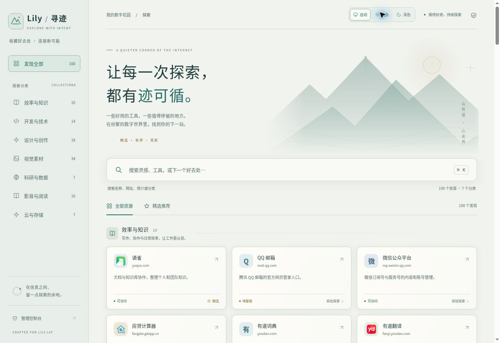
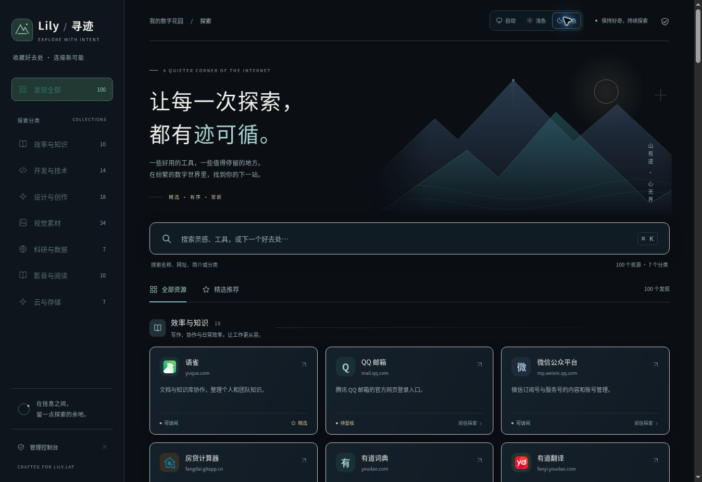
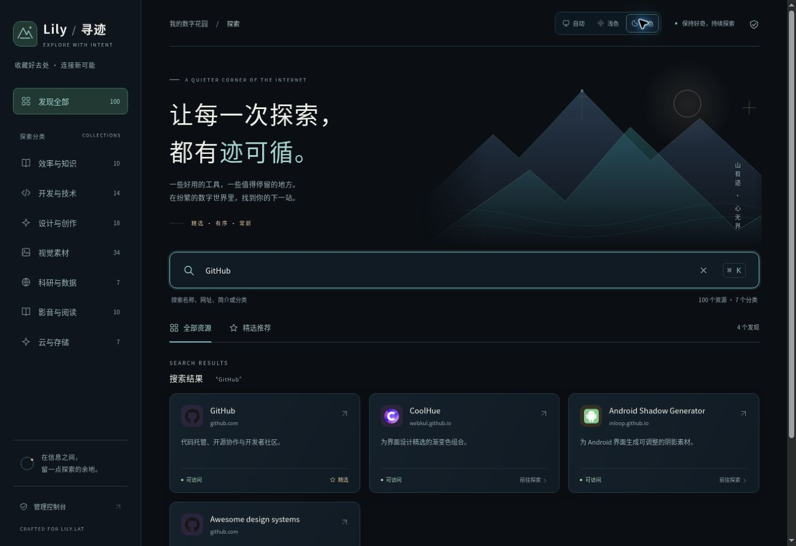
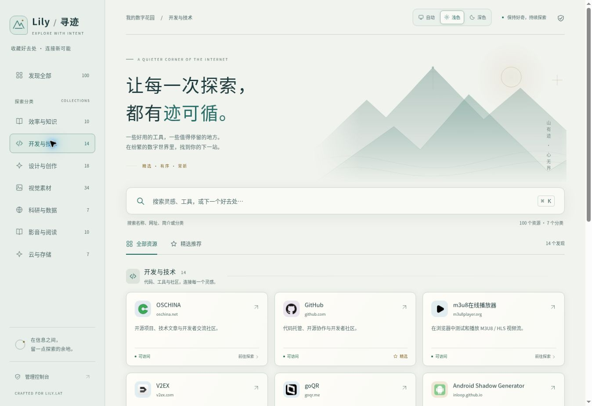
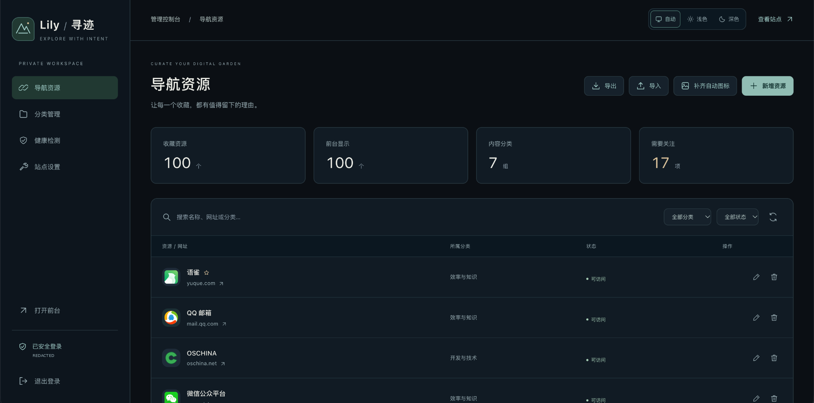
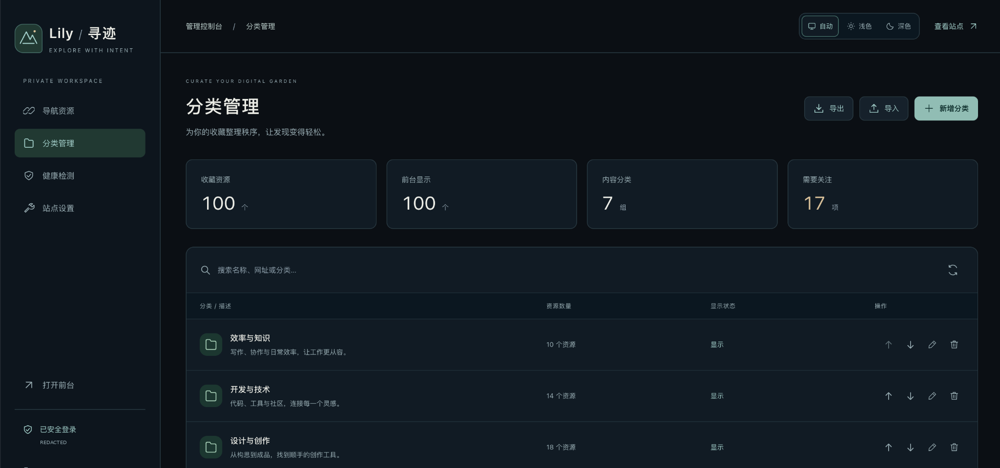
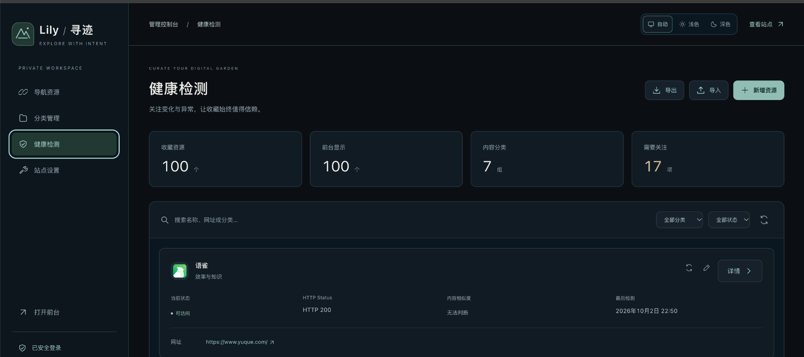
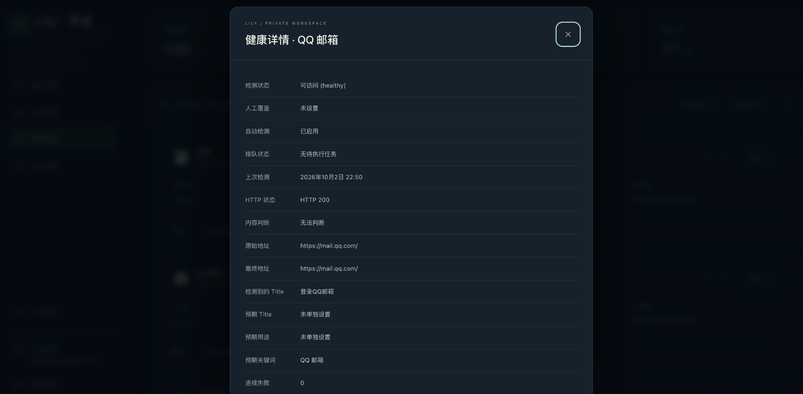
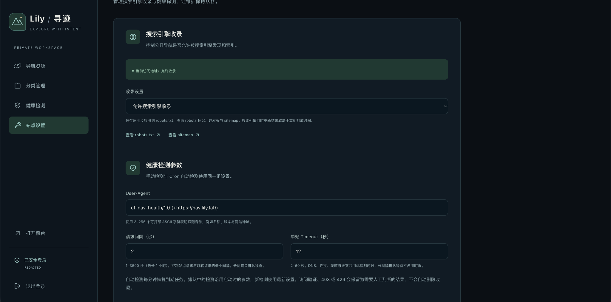
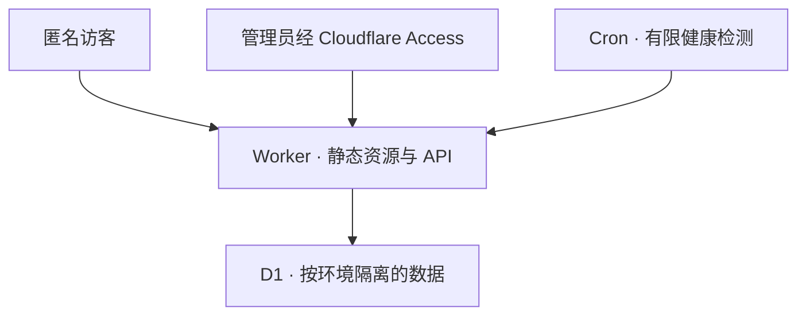

<h1 align="center">⛰️ cf-nav · Lily / 寻迹</h1>

<p align="center">
  <strong>收藏值得停留的地方，让每一次探索都有迹可循。</strong><br>
  公开导航 · 单管理员维护 · 运行于 Cloudflare
</p>

<p align="center">
  <a href="https://developers.cloudflare.com/workers/"></a>
  <a href="https://developers.cloudflare.com/d1/"></a>
  <a href="https://www.typescriptlang.org/"></a>
  <a href="LICENSE"></a>
  <a href="https://github.com/jacklilyhello/cf-nav/actions/workflows/ci.yml"></a>
</p>

<p align="center">
  <a href="README.md">English</a> · <strong>简体中文</strong><br>
  <a href="https://nav.lily.lat/">在线演示</a> · <a href="#部署">部署指南</a> · <a href="https://github.com/jacklilyhello/cf-nav/issues">问题反馈</a>
</p>



**cf-nav** 是使用 **TypeScript、Vite、Cloudflare Workers、D1、Cron Triggers 和 Cloudflare Access** 构建的导航与链接收藏系统。访客通过分类和搜索发现资源；一位管理员维护链接、图标，并结合定时检测结果判断网站状态。

[在线示例](https://nav.lily.lat/) 使用 Lily 的品牌和中文界面。中英文 README 说明的是同一套实现；应用目前没有提供英文界面切换。

> [!IMPORTANT]
> 上游部署配置专门对应 **nav.lily.lat 及其现有 Cloudflare 资源**。**Fork 后只填写 Secrets，不能直接部署为自己的新站。** 启用 Fork 部署前，需要替换资源名称、数据库 ID、Access 身份、域名及带保护检查的部署脚本。[详细部署指南](docs/deployment.md#简体中文) 分别说明原站更新和首次建站。

## 目录

- [功能特点](#功能特点)
- [界面截图](#界面截图)
- [系统架构](#系统架构)
- [部署](#部署)
- [本地开发](#本地开发)
- [后台与日常运维](#后台与日常运维)
- [常见问题](#常见问题)
- [项目结构](#项目结构)
- [参与贡献](#参与贡献)
- [参考资料](#参考资料)
- [许可证](#许可证)

## 功能特点

| 方向     | 已实现能力                                                                         |
| -------- | ---------------------------------------------------------------------------------- |
| 资源发现 | 分组卡片、分类筛选、精选推荐；按名称、网址、简介和分类搜索                         |
| 页面外观 | 响应式布局、柔和山水视觉；前台和后台均可选择自动、浅色、深色                       |
| 内容维护 | 分类排序、链接编辑、启用/精选状态、简介及仅管理员可见的备注                        |
| 图标管理 | 自动发现 HTTPS 图标、手动 HTTPS 图片或文字；无可用图标时显示本地首字母占位         |
| 健康检测 | HTTP 状态、跳转证据、页面标题、内容身份判断、历史、手动复查和独立人工覆盖          |
| 检测调度 | 有限的 Cron 工作量、共享请求间隔、单站超时和长间隔的 D1 延续任务                   |
| 搜索收录 | 仅生产域名可开启；联动 robots.txt、robots meta、X-Robots-Tag、sitemap 与 canonical |
| 管理身份 | Cloudflare Access 单管理员登录、Access JWT 验证和同源 CSRF 防护                    |
| 数据管理 | 测试/生产 D1 隔离、版本化迁移、一次性初始数据、经过验证的 JSON 导入导出            |
| 发布流程 | GitHub Actions 验证、手动生产部署及独立的受保护域名操作                            |

自动主题跟随设备的 `prefers-color-scheme`；手动选择保存在本地，刷新后仍有效。“自动”依据设备外观偏好，并非按固定日出日落时间切换。

系统面向匿名访客和**唯一管理员**。目前不提供公开注册、团队权限、评论或多人书签同步。运行不需要 VPS、KV、R2、Queue 或 Durable Object。

## 界面截图

浅色首页见文档顶部。前台图片于 **2026 年 10 月 3 日**从 nav.lily.lat 实际截取，五张后台图片由站点所有者于同日提供。可见管理员邮箱已遮盖；数量和检测结果仅代表截图时的状态。

### 前台导航 · 深色外观



### 搜索 · 名称、网址与简介



### 分类 · 按主题浏览



### 后台 · 导航资源



### 后台 · 分类管理



### 后台 · 健康检测



### 后台 · 健康详情



### 后台 · 站点设置



全部九张图片存放于仓库 `docs/screenshots/`，通过仓库相对路径引用并直接展开。在线演示不提供共用管理员账号。

## 系统架构

一个 Worker 通过 **Workers Static Assets** 提供 Vite 构建的前端，同时处理公开与后台 JSON API。**D1** 保存分类、链接、设置、检测历史和排队任务；**Cloudflare Access** 提供管理员身份，Worker 在每次后台 API 请求中独立验证。



测试和生产使用不同的 Worker、数据库及 Access 应用 audience；各登录域名拥有独立 Access 应用。公开目录不返回私有备注，也不展示禁用链接或分类。

检测会校验 URL、DNS 结果与跳转，限制请求和正文大小，并使用必需的 `global_fetch_strictly_public` 兼容性标志。HTTP 200 不足以证明网站仍提供原服务；WAF 验证、403 或 429 也不能直接证明网站失效。检测失败不会自动删除或永久隐藏资源。

身份验证、SSRF 边界、数据生命周期和设计说明见[架构文档](docs/architecture.md)。

## 部署

### 1. 准备 Cloudflare 与 GitHub

需要具备 Workers、D1 和已配置 Zero Trust 团队的 Cloudflare 账号；使用自定义域名时，域名需位于目标账号内。仓库需启用 GitHub Actions。实际费用和限额取决于 Cloudflare 套餐，不承诺任意规模下零费用。

GitHub 路径：**仓库 → Settings → Secrets and variables → Actions**。Token 放入 **Secrets**，非机密标识放入 **Variables**：

| 类型     | 名称                    | 获取位置 / 上游含义                                                                           |
| -------- | ----------------------- | --------------------------------------------------------------------------------------------- |
| Secret   | `CLOUDFLARE_API_TOKEN`  | Cloudflare → My Profile → API Tokens → Create Token → 自定义 Token；仅显示一次，复制至 GitHub |
| Variable | `CLOUDFLARE_ACCOUNT_ID` | 账号详情，或域名 Overview 页 API 区域                                                         |
| Variable | `CLOUDFLARE_ZONE_ID`    | 目标域名 Overview → API 区域 → Zone ID                                                        |
| Variable | `CF_WORKER_NAME`        | 生产 Worker 名称；上游域名操作要求为 `cf-nav`                                                 |
| Variable | `CF_PRODUCTION_DOMAIN`  | 不含协议和路径的域名；上游要求为 `nav.lily.lat`                                               |

以上名称对应真实工作流。数据库 ID 和 Access 配置位于 `wrangler.jsonc`，添加同名 GitHub Variables 不会覆盖它们。Worker 名称和 workers.dev 冒烟地址也写在工作流及脚本中。

### 2. 创建限定范围的 API Token

Account 权限仅选择**目标账号**，Zone 权限仅选择**目标区域**。控制台可能显示 **Edit**，API 文档显示 **Write**，均表示写权限。

| 范围    | 权限                                                         | 用途                                    |
| ------- | ------------------------------------------------------------ | --------------------------------------- |
| Account | Workers Scripts · Edit/Write                                 | Worker 部署、设置、Static Assets 和调度 |
| Account | D1 · Edit/Write                                              | 创建数据库、应用迁移和首次初始数据      |
| Account | Account Settings · Read                                      | Wrangler 使用的账号/子域名查询          |
| Account | Access: Apps and Policies · Edit/Write                       | 初始化单管理员登录应用                  |
| Account | Access: Organizations, Identity Providers, and Groups · Read | 读取 Zero Trust 组织和团队域名          |
| Zone    | Workers Routes · Edit/Write                                  | 检查路由及操作自定义域名                |
| Zone    | Zone · Read                                                  | 域名操作所需区域查询                    |

可对照[官方 Token 创建指南](https://developers.cloudflare.com/fundamentals/api/get-started/create-token/)和[权限列表](https://developers.cloudflare.com/fundamentals/api/reference/permissions/)。上表覆盖资源初始化、部署和域名流程；普通代码更新不必每次使用全部权限。无需 R2/KV 权限。自行修改 DNS 记录需另行考虑 DNS 权限，仓库脚本使用 Workers 自定义域名 API。

### 3. 更新现有上游站点

| 阶段           | 操作                                                             | 结果                                                          |
| -------------- | ---------------------------------------------------------------- | ------------------------------------------------------------- |
| 检查           | Actions → **Cloudflare Resources** → `inspect`                   | 读取资源和当前绑定，输出清单附件                              |
| 必要时初始化   | **Cloudflare Resources** → `provision`                           | 校验已有绑定/管理员，创建指定资源；不会部署 Worker 或迁移域名 |
| 测试部署       | 合并至 `main`，或运行 **Deploy**，选择 `staging`                 | 检查、迁移、首次初始数据、部署及 workers.dev 冒烟             |
| 验收           | 浏览测试站                                                       | 检查搜索、分类、主题和真实登录后的后台操作                    |
| 生产发布       | 从 `main` 运行 **Deploy**，选择 `production`                     | 更新生产 Worker，域名绑定单独管理                             |
| 必要时切换域名 | 从 `main` 运行 **Production Domain**，选 `production` 并勾选验收 | 校验生产源码 SHA 和绑定，仅切换指定域名                       |

通常推送到 `main` 自动部署的是**测试环境**，生产必须手动发布。旧 `codex/cloudflare-navigation` 分支也触发测试部署；其他 `codex/` 分支仅运行 CI。初始化返回的 ID 位于 Actions 附件，**不会自动写回 `wrangler.jsonc`**。

若域名已绑定生产 Worker，生产部署直接更新其提供的代码，无需再次切换。现有上游回退依赖保留旧 Worker `websitenavigation`。

### 4. 把 Fork 部署为独立新站

启用 Fork 部署前，按[首次建站指南](docs/deployment.md#新站或-fork-首次部署)创建隔离的测试/生产数据库，配置自己的 Access 应用与管理员哈希，替换上游域名和资源 ID，并适配假设已有 Lily 安装的脚本。**只修改 `CF_PRODUCTION_DOMAIN` 不够。**

当前资源/域名脚本会主动拒绝没有预期旧绑定的新域名，不能原样用于新站。详细指南提供手动创建初始资源路线，并列出需要修改的文件。

## 本地开发

使用 **Node.js 22.22+**，须在 `package.json` 支持范围内（`>=22.22.0 <27`）；CI 使用 Node 22。

```sh
git clone https://github.com/jacklilyhello/cf-nav.git
cd cf-nav
npm ci
npm run build
npm run db:local
npm run seed:local
npm run dev
```

打开 Wrangler 输出的本地地址。本地前台无需 Cloudflare 凭据；D1 保存在 `.wrangler/`，需要保留数据时不要清空。`npm run dev` 会重新构建前端，再启动 staging Wrangler。

```sh
npm run check
npm audit --omit=dev --audit-level=high
npx wrangler deploy --dry-run --env staging --outdir build/worker
```

`check` 包含 lint、两个 TypeScript 目标、单元/集成测试和前端构建。身份验证始终启用：本地后台逻辑通过测试验证，线上验收使用真实 Access 登录。没有开发密码或远程认证绕过。

## 后台与日常运维

访问站点 `/admin`，通过配置好的 Access 应用登录。后台分为**导航资源、分类管理、健康检测、站点设置**。

### 健康检测参数

| 设置       | 默认值                                       | 允许范围                  |
| ---------- | -------------------------------------------- | ------------------------- |
| User-Agent | `cf-nav-health/1.0 (+https://nav.lily.lat/)` | 3–256 个可打印 ASCII 字符 |
| 请求间隔   | 2 秒                                         | 1–3600 的整数秒           |
| 单站超时   | 12 秒                                        | 2–60 的整数秒             |

手动和 Cron 检测共用设置及全局 D1 租约，每分钟最多顺序处理两个链接或延续任务。长间隔把到期时间保存在 D1，等待后续 Cron 恢复；刻意安排的等待不计入单站累计活跃时限。排队任务保留入队参数，每个链接的手动复查最多每分钟一次。

维护预期标题、关键词和用途，可以改善网站身份判断。内容相似度是启发式分数，不是经过统计校准的概率；人工覆盖与实际结果分开保存。

### 收录、图标与备份

- **收录：**仅配置的生产 origin 可开启；测试站、替代 workers.dev 地址、后台/API/错误响应均保持 noindex。关闭收录时，公开页仍允许抓取，便于搜索引擎读到 noindex。
- **图标：**创建、相关修改或主动刷新时执行发现；手动 HTTPS/文字及仅占位模式会保留。没有图片上传或存储服务。
- **备份：**批量编辑前导出 version-1 JSON。导入按 ID 合并，单文件最多 8 MiB、1,000 条链接、100 个分类。大备份分卷导出，请保留全部分卷并按顺序导入。包含私有备注，不包含自动检测结果/历史或站点全局设置。
- **更新：**Deploy 执行迁移及首次初始数据。seed 标记保护后续后台修改；无标记但已有内容时拒绝覆盖。不要为了排查部署问题重建生产 D1。

恢复、状态解释、迁移兼容性和隔离验收工具详见[运维与回退文档](docs/operations.md)。

## 常见问题

| 现象                                                             | 排查与处理                                                                     |
| ---------------------------------------------------------------- | ------------------------------------------------------------------------------ |
| Fork 仍指向 Lily 的资源                                          | 检查 `wrangler.jsonc`、工作流地址和资源/域名脚本；Secrets 无法单独改变目标     |
| `Unexpected deployment target` / `Unexpected production binding` | 上游保护拒绝不同安装，按新站流程适配，不要盲目删除校验                         |
| Cloudflare 权限错误                                              | 核对 Token 有效期、账号/Zone 范围及失败操作权限，Token 保留在 Secrets          |
| 后台登录循环或 401/403                                           | 核对本域名 `/admin/login` 应用、唯一邮箱策略、团队域名、AUD 与标准化管理员哈希 |
| HTTP 200 但需要复核                                              | 补充可靠身份基准；验证页、跳转或内容不足可能使身份无法确认                     |
| 长间隔检测仍排队                                                 | 查到期时间、保存的参数和每分钟 Cron；排队不代表已完成                          |
| 图标不显示                                                       | 主动刷新或使用手动 HTTPS/文字，无效图标显示本地占位                            |
| 收录未立即反映                                                   | 核对生产 origin 及 robots/meta/header/sitemap，等待重新抓取                    |
| 本地缺数据库或构建                                               | 按顺序构建、迁移、初始数据，保留已有本地 D1                                    |

## 项目结构

| 路径                 | 用途                                  |
| -------------------- | ------------------------------------- |
| `src/frontend/`      | 公开目录、主题、搜索、样式和前端工具  |
| `src/admin/`         | 内容、检测和设置的管理员工作台        |
| `src/api/`           | 校验、身份验证、CSRF、增删改查及备份  |
| `src/health/`        | 公开 URL 验证、有限探测、分类和调度   |
| `src/icons/`         | 图标发现和验证                        |
| `src/worker/`        | 路由、安全响应头、SEO 和 Cron         |
| `migrations/`        | 版本化 D1 结构                        |
| `data/`              | 审核后的公开旧导航清单和初始目录      |
| `scripts/`           | 资源、seed、冒烟和域名工具            |
| `.github/workflows/` | CI、部署及域名操作                    |
| `docs/`              | 架构、部署、运维和截图                |
| `tests/`             | 安全、API、探测、数据、主题和集成覆盖 |

## 参与贡献

通过 [Issues](https://github.com/jacklilyhello/cf-nav/issues) 提交可复现问题或具体建议。修改前阅读 [CODEX.md](CODEX.md)，使用功能分支，运行相关检查，并在 PR 中说明验证结果。不要提交密钥或管理员私有资料；保留后台已有修改，维护单管理员和仅公开网络探测边界。

## 参考资料

- [Workers Static Assets](https://developers.cloudflare.com/workers/static-assets/)
- [D1 迁移](https://developers.cloudflare.com/d1/reference/migrations/)
- [Cron Triggers](https://developers.cloudflare.com/workers/configuration/cron-triggers/)
- [Access 应用 Token](https://developers.cloudflare.com/cloudflare-one/access-controls/applications/http-apps/authorization-cookie/application-token/)
- [Workers 自定义域名](https://developers.cloudflare.com/workers/configuration/routing/custom-domains/)
- [仅公开网络 fetch](https://developers.cloudflare.com/workers/configuration/compatibility-flags/#global-fetch-strictly-public)

## 许可证

项目代码以 [MIT License](LICENSE) 发布。示例目录中的第三方名称、网站图标和链接内容，其权利仍归各自所有者。
